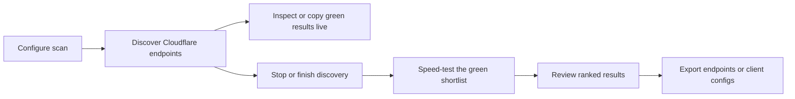

<p align="center"></p>

<p align="center">
  <strong>Find, validate, rank, and export resilient Cloudflare endpoints.</strong><br>
  One scanning engine. Three focused experiences for desktop, Android, and the terminal.
</p>

<p align="center">
  <a href="README.fa.md">فارسی</a> ·
  <a href="https://github.com/MatinSenPai/SenPaiScanner/releases/latest">Download</a> ·
  <a href="https://github.com/MatinSenPai/SenPaiScanner/issues">Report an issue</a>
</p>

<p align="center">
  <a href="https://github.com/MatinSenPai/SenPaiScanner/stargazers"></a>
  <a href="https://github.com/MatinSenPai/SenPaiScanner/releases"></a>
  <a href="https://github.com/MatinSenPai/SenPaiScanner/forks"></a>
  <a href="https://github.com/MatinSenPai/SenPaiScanner/releases/latest"></a>
  <a href="LICENSE"></a>
</p>

---

SenPai Scanner is a cross-platform Cloudflare endpoint scanner for unstable, filtered, or high-latency networks. It performs fast edge probing, can validate the best candidates through your real proxy configuration with an embedded Xray core, and turns the results into client-ready exports.

Version **1.1.1** brings every desktop feature to the Android app (Anti-DPI settings, pasted targets, Gentle profile, skip-reachability, resumable scans) and the new black / white / red look. Version **1.1.0** added real **Anti-DPI** (TLS ClientHello fragmentation with editable values) to every probe and to tunnel validation, and a new black / white / red look across the desktop GUI, the Android app, and the terminal UI, with a new logo and banner.

## What makes it useful

| Capability | What it gives you |
|---|---|
| **Two-stage validation** | Fast Cloudflare reachability checks followed by optional end-to-end Xray tests |
| **Live results** | Search, sort, inspect, and copy healthy endpoints while a scan is still running |
| **Post-stop speed test** | Stop discovery when you have enough green results, then speed-test that exact shortlist |
| **Safe neighbor discovery** | Nearby Cloudflare addresses are explored only when you explicitly enable the option |
| **Proxy-aware probing** | SNI, host, path, transport, TLS, and port are derived from VLESS, Trojan, or VMess links |
| **Portable exports** | Raw endpoints, rewritten share URLs, subscription data, Sing-box JSON, and Clash YAML |
| **Resilient metadata** | ISP and ASN detection merges Cloudflare, IPWhois, and IPinfo, with Team Cymru DNS fallback |

## Choose your interface

| Interface | Platforms | Best for |
|---|---|---|
| **Desktop GUI** | Windows, Linux, macOS | Full Signal Desk experience, persistent sessions, live filtering, speed tests, and exports |
| **Android app** | Android 7.0+ | The same Scan / Results / Export flow with native Material 3 controls |
| **CLI / TUI** | Windows, Linux, macOS, Termux | Keyboard-first scanning, automation-friendly binaries, and low-overhead remote use |

## Signal Desk workflow



The desktop and Android interfaces keep each responsibility in its own workspace:

- **Scan** — configure source, ports, workers, timeout, WebSocket requirement, proxy URL, and the optional neighbor scan.
- **Results** — monitor progress, filter and sort endpoints, copy all green results or the top 20 at any time, then run the focused speed test after stopping.
- **Export** — copy raw endpoints or generate client-ready configurations after validation.

## Core features

### Discovery and ranking

- Weighted random sampling across embedded Cloudflare IPv4 ranges.
- File-based input in the desktop and CLI workflows, including IP, CSV, and CIDR entries.
- Multi-port probing with configurable worker count, timeout, and WebSocket checks.
- Live health, latency, loss, throughput, colo, port, and status reporting.
- Optional neighbor scanning in both GUI and CLI; it is **off by default**.
- Cancellation that preserves results already discovered.

### Validation and speed testing

- Supported share links: `vless://`, `trojan://`, and `vmess://`.
- Transport-aware parsing for TCP, WebSocket, gRPC, and XHTTP/SplitHTTP settings.
- Embedded Xray validation against the actual proxy configuration.
- Download throughput and TTFB measurement, with optional upload testing where configured.
- A dedicated speed-test action for the current healthy set after discovery stops.

### Copy and export

- Copy a single endpoint, every green endpoint, or the top 20 without waiting for discovery to finish.
- Copy validated `IP:port` endpoints.
- Rewrite the original share link for every passing endpoint.
- Generate a Base64 subscription, Sing-box JSON, and Clash YAML.
- Keep Results and Export separate, so exporting never interrupts result inspection.

### Anti-DPI

Deep-packet-inspection boxes often match the SNI in the first TLS packet. With Anti-DPI on, the scanner cuts that ClientHello into small pieces before it leaves your machine, for **every probe** and for the **xray tunnel validation**.

- Defaults are the published values from [t.me/MatinSenPaii/5469](https://t.me/MatinSenPaii/5469): a `tlshello` fragment mask (`lengths 0/104/1`) followed by a first-packet mask (`lengths 114/1`, `delay 1 ms`, `maxSplit 11`), fingerprint `unsafe`, ALPN `http/1.1`, and the cipher-suite list from the post.
- Every field is editable in the desktop app (section **02 Anti-DPI**, with a **Suggested values** button). The TUI has an on/off row in the config screen and reads the same values from `anti_dpi` in its config file. The Android app takes the same switch through its scan config (`antiDpi`).
- Only `fragment` masks are supported; anything else is reported instead of being silently ignored. Go's TLS stack only lets you choose TLS 1.2 cipher suites, so the TLS 1.3 ones in the list are skipped for the direct probes.
- Stock xray-core cannot parse per-segment `lengths` / `delays`, so the fragmentation runs in a tiny local forwarder in front of the outbound (`internal/antidpi`).

### Plain text mode (screen readers and scripts)

The full-screen terminal UI is hard to use with NVDA, JAWS or Orca. Plain text mode prints one complete sentence per line: no colours, no redraws, no cursor tricks.

```bash
senpaiscanner --plain          # answers a few questions, then scans
senpaiscanner scan -count 5000 -gentle -config "vless://..."
senpaiscanner scan -resume     # continue the interrupted scan
senpaiscanner help             # every option
```

Progress is announced on a timer (`-progress 15s`) and only when it changed; healthy addresses are announced as they appear (the first 25), and the final list is printed at the end and optionally written with `-output file.txt`.

### Your own targets, Gentle mode, and resuming

- **Paste your own list** (desktop: *IP source → Paste list*; CLI: `-targets` / `-targets-file`): IPs, CIDRs, ranges (`1.2.3.4-1.2.3.40`) and domain names, which are resolved to their addresses. Bad entries are reported, not silently dropped.
- **Skip the reachability scan** (*Skip the reachability scan* / `-phase2-only`): test your list directly, through your config if you gave one, or with a direct download sample if not.
- **Gentle mode** (*Scan profile → Gentle* / `-gentle` / the *Profile* row in the terminal UI): at most 25 workers, at least a 6 s timeout and 40 probes per second, for ISPs that cut the connection when a scan looks like a flood.
- **Resume**: every scan saves its progress (target pool, what was probed, healthy results, finished validations) in your config folder every 20 seconds and when you stop it. After a crash, a power cut or a closed window the desktop app offers *Resume scan*; the CLI continues with `scan -resume`. A scan that finishes removes its saved state.

## Download version 1.1.1

Download the build for your platform from [GitHub Releases](https://github.com/MatinSenPai/SenPaiScanner/releases/latest). The `v1.1.1` release workflow builds and publishes every supported interface together and adds `SHA256SUMS.txt`.

### Desktop GUI

| Platform | Release asset |
|---|---|
| Windows x64 | `SenPaiScanner-1.1.1-gui-windows-amd64.zip` |
| Linux x64 | `SenPaiScanner-1.1.1-gui-linux-amd64.tar.gz` |
| macOS Intel | `SenPaiScanner-1.1.1-gui-macos-intel.zip` |
| macOS Apple Silicon | `SenPaiScanner-1.1.1-gui-macos-apple-silicon.zip` |

The Windows executable and Android application use the artwork from [`logo/logo.png`](logo/logo.png) (regenerate all icons with `python gen_icons.py`).

### CLI / TUI

| Platform | Release asset |
|---|---|
| Windows x64 | `SenPaiScanner-1.1.1-cli-windows-amd64.exe` |
| Windows ARM64 | `SenPaiScanner-1.1.1-cli-windows-arm64.exe` |
| Linux x64 | `SenPaiScanner-1.1.1-cli-linux-amd64` |
| Linux ARM64 / Termux | `SenPaiScanner-1.1.1-cli-linux-arm64` |
| Linux ARMv7 / 32-bit Termux | `SenPaiScanner-1.1.1-cli-linux-armv7` |
| macOS Intel | `SenPaiScanner-1.1.1-cli-macos-intel` |
| macOS Apple Silicon | `SenPaiScanner-1.1.1-cli-macos-apple-silicon` |

On Linux and macOS, make the downloaded CLI executable before running it:

```bash
chmod +x SenPaiScanner-1.1.1-cli-*
./SenPaiScanner-1.1.1-cli-linux-amd64
```

### Android

| Release asset | Device |
|---|---|
| `SenPaiScanner-1.1.1-android-universal.apk` | Recommended sideload build for all supported ABIs |
| `SenPaiScanner-1.1.1-android-arm64-v8a.apk` | Most current 64-bit Android devices |
| `SenPaiScanner-1.1.1-android-armeabi-v7a.apk` | Older 32-bit ARM devices |

Android requires API 24 or newer. If you sideload an APK, Android may ask you to permit installation from the app that opened the file.

## Quick start

### Desktop or Android

1. Open **Scan** and keep the defaults for a first pass.
2. Add a VLESS, Trojan, or VMess URL if you want proxy-aware probing and client exports.
3. Enable **Neighbor scan** only if you want the wider search.
4. Start discovery and switch to **Results** whenever you want; the scan continues in the background.
5. Use **Copy green** or **Copy top 20** at any time.
6. Stop the scan when the shortlist is sufficient, then choose **Speed test green results**.
7. Open **Export** to copy raw endpoints or generate client configurations.

### CLI / TUI

```bash
senpaiscanner
senpaiscanner --version
```

Navigate with the arrow keys or `h` / `j` / `k` / `l`, confirm with `Enter`, go back with `Esc`, and stop an active scan with `q`. The TUI remembers the last scan configuration and exposes it through **Retry Last Scan**.

For file mode, place `ips.txt` next to the executable or in the current working directory. Accepted lines include a plain IPv4 address, the first field of a CSV line, or a CIDR. Blank lines and lines beginning with `#` are ignored.

### Termux

Use the Linux ARM64 CLI asset on modern phones:

```bash
pkg update
pkg install curl -y
curl -fL -o "$PREFIX/bin/senpaiscanner" \
  https://github.com/MatinSenPai/SenPaiScanner/releases/download/v1.1.1/SenPaiScanner-1.1.1-cli-linux-arm64
chmod +x "$PREFIX/bin/senpaiscanner"
senpaiscanner
```

The native Android app is recommended if you prefer touch controls, system clipboard integration, and the full Signal Desk layout.

## Build from source

### Requirements

- Go **1.26.1** or the version declared in [`go.mod`](go.mod)
- Wails **2.11.0** plus the native webview dependencies for desktop GUI builds
- JDK **17**, Android SDK **36**, and Android Build Tools **36.0.0** for Android builds
- `gomobile` and `gobind` for rebuilding the Android Go bridge

### Test and build the CLI

```bash
go test -short ./...
go vet ./...
go build -trimpath -o senpaiscanner ./cmd/senpaiscanner
```

Windows can produce the versioned cross-platform CLI set with:

```powershell
./build.ps1 -Version 1.1.1
```

### Build the desktop GUI

Install Wails, then build from the `desktop` directory:

```powershell
go install github.com/wailsapp/wails/v2/cmd/wails@v2.11.0
cd desktop
./build_gui.ps1 -Version 1.1.1
```

Linux requires GTK 3 and WebKitGTK 4.1 development packages. macOS builds require the native Xcode toolchain. GitHub Actions builds each GUI on its target operating system rather than cross-compiling webviews.

### Build Android

```bash
# Linux / macOS
./android/build_go_mobile.sh
cd android
./gradlew testDebugUnitTest lintRelease assembleRelease
```

```powershell
# Windows
./android/build_go_mobile.bat
cd android
./gradlew.bat testDebugUnitTest lintRelease assembleRelease
```

Release APK signing uses these GitHub repository secrets:

- `ANDROID_KEYSTORE_BASE64`
- `ANDROID_KEYSTORE_PASSWORD`
- `ANDROID_KEY_ALIAS`
- `ANDROID_KEY_PASSWORD`

When they are absent, CI creates an ephemeral signing key for test artifacts. Those builds cannot update an application signed with a permanent production key.

## Release automation

The repository keeps platform builds separate and composes them in one final release:

| Workflow | Responsibility |
|---|---|
| [`ci.yml`](.github/workflows/ci.yml) | Cross-platform Go build, vet, test, race test, and lint |
| [`build-cli.yml`](.github/workflows/build-cli.yml) | Six versioned CLI targets |
| [`build-gui.yml`](.github/workflows/build-gui.yml) | Native Windows, Linux, Intel macOS, and Apple Silicon GUI packages |
| [`build-android.yml`](.github/workflows/build-android.yml) | Go mobile bridge, Android tests/lint, signed ABI APKs, and universal APK |
| [`release.yml`](.github/workflows/release.yml) | Publishes the complete **v1.1.1** release and SHA-256 checksums |

Pushing the exact tag `v1.1.1` starts the final release workflow.

## Repository map

```text
cmd/senpaiscanner/   CLI entry point
desktop/             Wails desktop backend and Signal Desk frontend
android/             Native Kotlin + Jetpack Compose application
mobile/              Go mobile bridge shared with Android
internal/            Scanner, probe, Xray, metadata, export, and TUI packages
logo/logo.png        Transparent source artwork
.github/workflows/   CI and release automation
```

## Security and responsible use

SenPai Scanner makes outbound network requests and may launch an embedded Xray process for local validation. Proxy share URLs often contain credentials: avoid posting them in issues, screenshots, logs, or exported samples. Scan only networks and address ranges you are authorized to test, and follow the rules that apply in your jurisdiction and on your network.

## Troubleshooting

- **No healthy results:** try a longer timeout, fewer workers, another port, or a different network. Leave neighbor scanning off until the baseline scan behaves predictably.
- **Phase 1 passes but speed validation fails:** verify the proxy URL, SNI/host, transport path, and upstream server in a known-working Xray client.
- **My connection drops while scanning (#25, #56, #62, #96):** turn on **Gentle** mode (desktop *Scan profile*, terminal UI *Profile* row, or `-gentle`). Users report that 25 workers and a 6 s timeout is the limit many ISPs tolerate. Power-cycling the modem first helps if the line is already throttled.
- **Every Phase 2 test fails (#82, #102, #55):** the Anti-DPI recipe is on by default and its values change over time; edit them or try **Suggested values**, and verify your config in a normal Xray client.
- **Where are the results saved? (#90):** a live results file named `SenPaiScannerResult-<date>.txt` is written next to the executable (or in the folder you started it from) while the scan runs, and its path is printed at the start. In Termux that is the folder you ran `senpaiscanner` from, for example `~`.
- **macOS says the file cannot be opened (#54, #112):** `chmod +x ./SenPaiScanner-*-cli-macos-*` and, if Gatekeeper still blocks it, `xattr -cr ./SenPaiScanner-*-cli-macos-*`. Use `macos-apple-silicon` for M1 and later, `macos-intel` otherwise.
- **How do I run the Linux binary? (#114):** it has no extension. `chmod +x ./SenPaiScanner-*-cli-linux-amd64` and run it with `./`. ARM boards and 64-bit phones use `linux-arm64`, 32-bit ones `linux-armv7`.
- **I cannot paste into the terminal UI (#44):** terminals differ: try `Shift+Insert`, `Ctrl+Shift+V`, or right-click; over PuTTY, middle-click pastes. If none works, use plain text mode and pass the link with `-config`, or the desktop app.
- **Screen reader (NVDA, JAWS, Orca):** use plain text mode, `senpaiscanner --plain`.
- **Clipboard fails in a terminal:** use the generated output file or copy from the desktop/Android Results workspace.
- **Android release will not update an installed build:** both APKs must be signed by the same key. Configure the permanent signing secrets before publishing production releases.
- **Need help:** open an issue with the app version, OS/architecture, interface, and reproducible steps—but remove proxy credentials first.

## Nahan Mode

**Nahan Mode** is a specialized scanning mode that discovers, ranks, and exports Cloudflare endpoints optimized for the **Nahan panel** (Cloudflare Worker based). It produces ready-to-use endpoint lists filtered by target country (Egypt, Nigeria) with deterministic numbering.

### Quick Start

```bash
# Build the nahan binary
go build -trimpath -o senpaiscanner-nahan ./cmd/nahan

# Scan for Egypt and Nigeria endpoints (default)
./senpaiscanner-nahan

# Scan only Egypt with custom limits
./senpaiscanner-nahan --country EG --max-probes 5000 --max-results 100 --workers 100 --timeout 3s

# Use a config file
./senpaiscanner-nahan --config nahan.yaml

# Use your own IP list
./senpaiscanner-nahan --input my-ips.txt --country EG,NG
```

### Configuration File (`nahan.yaml`)

```yaml
mode: nahan
countries:
  - EG
  - NG
scan:
  workers: 100
  timeout: 3s
  max_probes: 5000
  max_results: 100
  ports: [443, 80, 8443, 2053, 2083, 2087, 2096]
  dedup_mode: best-port-only
  geoip_enabled: false
output:
  directory: ./nahan
  txt: true
  csv: true
```

### Command-line Flags

| Flag | Default | Description |
|------|---------|-------------|
| `--country` | `EG,NG` | Comma-separated: `EG`, `NG`, `ALL` |
| `--input` | *(empty)* | Input file (IPs, CIDRs, ranges); empty = embedded CF ranges |
| `--output-dir` | `./nahan` | Output directory |
| `--max-probes` | `5000` | Maximum IPs to probe |
| `--max-results` | `100` | Maximum healthy results per country |
| `--workers` | `100` | Concurrent workers |
| `--timeout` | `3s` | Probe timeout |
| `--ports` | `443,80,8443...` | Ports to test |
| `--dedup-mode` | `best-port-only` | `best-port-only` or `all-healthy-ports` |
| `--config` | *(empty)* | YAML config file path |

### Input Formats

The `--input` file accepts:
```
# Comments and blank lines ignored
1.2.3.4
1.2.3.4/32
1.2.3.0/24
1.2.3.4-1.2.3.40
example.com
```

### Output Files

```
nahan/
├── nahan-eg.txt       # Egypt endpoints: IP#EG-01, IP#EG-02...
├── nahan-ng.txt       # Nigeria endpoints: IP#NG-01, IP#NG-02...
└── nahan-results.csv  # Full metadata for debugging
```

**TXT format** (one per line):
```
104.16.0.1#EG-01
104.16.0.2#EG-02
172.64.0.1#NG-01
```

**CSV columns**:
```
country,ip,port,colo,asn,isp,latency_ms,loss_pct,throughput_mbps,score,status,probe_mode,tls_success,ws_success,country_confidence
EG,104.16.0.1,443,CAI,13335,Cloudflare Inc.,45.2,0.0,12.5,0.87,healthy,http,true,true,0.90
```

### Country Classification

Endpoints are assigned to countries using (in priority order):

1. **Cloudflare colo code** (primary) — maps CAI/ALEX/HRG→EG, LOS/ABV/PHC→NG, etc. (confidence 0.7)
2. **ASN organization name** (fallback) — matches "Telecom Egypt", "MTN Nigeria", etc. (confidence 0.5)
3. **UNKNOWN** — if no confident match

> **Why colo-based?** Nahan needs endpoints that work **for users in Egypt/Nigeria**. Cloudflare routes users to the nearest PoP (Point of Presence). An Egyptian user connects to CAI (Cairo), a Nigerian user to LOS (Lagos). The colo code identifies the serving edge, not the IP's registered location (which is often US for Cloudflare IPs). This is exactly what Nahan needs.

### Health Scoring

Each endpoint receives a **health score (0.0–1.0)** based on:

| Component | Weight | Description |
|-----------|--------|-------------|
| Reachability | 30% | Passes Phase 1 health checks |
| Latency | 15% | Lower is better (capped at 500ms) |
| Packet Loss | 15% | Lower is better |
| Throughput | 15% | Higher is better (log scale) |
| TLS Success | 10% | TLS handshake succeeded |
| WebSocket Success | 10% | WS upgrade succeeded |
| Colo Bonus | 5% | +0.1 if colo in country's preferred list |

Endpoints are ranked by score (descending) per country, then top-N selected.

### Deduplication

- **`best-port-only`** (default): Keep highest-scoring port per IP
- **`all-healthy-ports`**: Keep all healthy ports per IP

### Differences from Main Scanner

| Feature | Main Scanner | Nahan Mode |
|---------|-------------|------------|
| Purpose | General CF endpoint discovery | Nahan panel endpoint generation |
| Output | CSV/JSON/TXT, Sing-box, Clash | `nahan-XX.txt`, `nahan-results.csv` |
| Country filter | Colo filter only | Country-aware with confidence |
| Ranking | Latency/loss/speed | Multi-factor health score |
| Numbering | None | Deterministic per country (XX-01, XX-02...) |

### Security Note

Nahan Mode only scans **Cloudflare IP ranges** (official `cloudflare.com/ips-v4` or user-provided CIDRs). It does not perform general internet scanning. Only test networks you are authorized to probe.

## Contributing

Issues and pull requests are welcome. Read [`CONTRIBUTING.md`](CONTRIBUTING.md) before making a larger change, and include tests for scanner, parser, export, or state-management behavior when practical.

## License

SenPai Scanner is available under the [MIT License](LICENSE).
